# DukaanFlow — Inventory & Billing System

<div align="center">


[](https://openjdk.org/projects/jdk/21/)
[](https://spring.io/projects/spring-boot)
[](https://react.dev/)
[](https://www.postgresql.org/)
[](https://jwt.io/)
[](https://vite.dev/)

**A full-stack multi-tenant SaaS inventory and billing system built for Indian local businesses.**

[Features](#-features) • [Tech Stack](#-tech-stack) • [Architecture](#-architecture) • [Screenshots](#-screenshots) • [Getting Started](#-getting-started) • [API Docs](#-api-endpoints)

</div>

---

## 🧩 Problem Statement

Millions of small businesses in India — kirana stores, medical shops, clothing stores — still manage inventory using paper registers or basic Excel files. This leads to:

- No real-time stock tracking → overselling out-of-stock products
- Manual billing → errors and slow customer service
- No profit insights → no idea which products actually make money
- No customer history → can't identify best customers

**DukaanFlow solves all of this** with a modern, web-based system that any shop owner can use from a browser.

---

## ✨ Features

| Feature | Description |
|---|---|
| 🏪 Multi-Tenant | Each shop gets fully isolated data — one system, many shops |
| 🔐 JWT Auth | Secure stateless authentication with BCrypt password hashing |
| 📦 Inventory | Full product & category management with SKU, stock tracking |
| 🧾 Invoicing | Create professional invoices with discount, tax, PDF download |
| 👥 Customers | Customer database with total purchase tracking |
| 📊 Dashboard | Real-time revenue, stock alerts, sales overview chart |
| 📈 Profit & Loss | Product-wise revenue, cost, profit margin analytics |
| 📄 PDF Generation | Professional tax invoices generated in-memory with iText 7 |
| 📱 Responsive | Mobile-first design with card layouts for small screens |

---

## 🛠 Tech Stack

### Backend
| Technology | Version | Purpose |
|---|---|---|
| Java | 21 (LTS) | Core language |
| Spring Boot | 3.2.5 | REST API framework |
| Spring Security | 6.x | Authentication & authorization |
| Spring Data JPA | 3.x | ORM & database layer |
| PostgreSQL | 16 | Relational database |
| JJWT | 0.11.5 | JWT token generation & validation |
| iText 7 | 7.2.5 | PDF invoice generation |
| Lombok | Latest | Boilerplate reduction |
| SpringDoc OpenAPI | 2.3.0 | Swagger API documentation |

### Frontend
| Technology | Version | Purpose |
|---|---|---|
| React | 19 | UI framework |
| Vite | 8 | Build tool & dev server |
| React Router DOM | 7 | Client-side routing |
| Axios | 1.x | HTTP client with interceptors |
| Tailwind CSS | 4 | Utility-first styling |
| Recharts | 3.x | Dashboard charts |
| Lucide React | Latest | Icon library |
| React Hot Toast | 2.x | Toast notifications |

---

## 🏗 Architecture

```
┌─────────────────────────────────────────────────────┐
│                  React Frontend                      │
│  Vite + React 19 + React Router + Axios             │
│                                                      │
│  AuthContext (JWT in localStorage)                   │
│  Axios Interceptor (auto-attach Bearer token)        │
└──────────────────────┬──────────────────────────────┘
                       │ HTTPS · JSON
                       │ Authorization: Bearer <token>
                       ▼
┌─────────────────────────────────────────────────────┐
│              Spring Boot Backend                     │
│                                                      │
│  ┌─────────────┐  ┌──────────────┐  ┌───────────┐  │
│  │  JwtFilter  │→ │  Controller  │→ │  Service  │  │
│  └─────────────┘  └──────────────┘  └─────┬─────┘  │
│                                           │         │
│  ┌──────────────────────────────────┐     │         │
│  │  ShopContext.getCurrentShopId()  │ ←───┘         │
│  │  (Multi-tenancy enforcement)     │               │
│  └──────────────────────────────────┘               │
│                         │                           │
│                   Repository                        │
│          (all queries filtered by shop_id)          │
└─────────────────────────┬───────────────────────────┘
                          │ SQL
                          ▼
┌─────────────────────────────────────────────────────┐
│                  PostgreSQL                          │
│                                                      │
│  shops · users · categories · products              │
│  customers · invoices · invoice_items               │
└─────────────────────────────────────────────────────┘
```

### Request Flow
1. React sends request with `Authorization: Bearer <token>`
2. `JwtFilter` validates token → extracts email → sets auth in `SecurityContextHolder`
3. Controller receives request → calls Service
4. `ShopContext.getCurrentShopId()` reads current user's shop from SecurityContextHolder
5. Repository queries DB with `WHERE shop_id = ?` — data isolation enforced
6. Response mapped to DTO → returned as JSON

### Multi-Tenancy Design
Every entity (`Category`, `Product`, `Customer`, `Invoice`) has a `shop_id` foreign key. `ShopContext` extracts the authenticated user's shop from the JWT on every request — no cross-shop data leakage is possible.

---

## 📸 Screenshots

### Landing Page
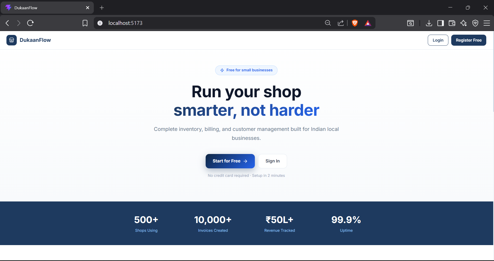

### Login & Register
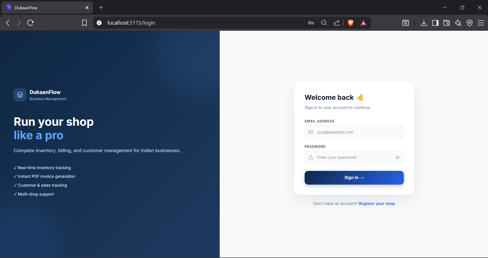
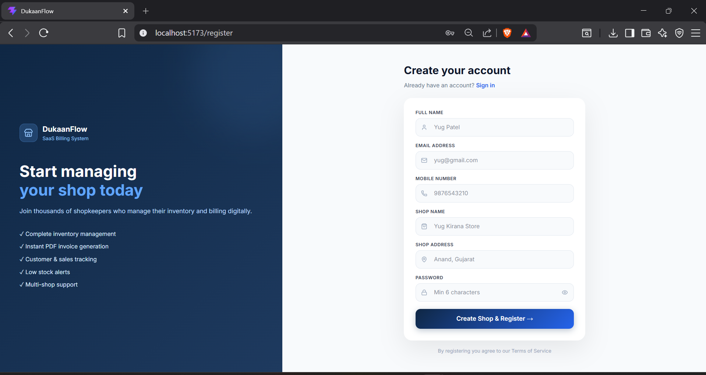

### Dashboard
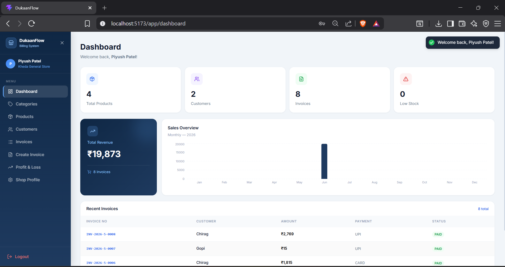

### Products Management
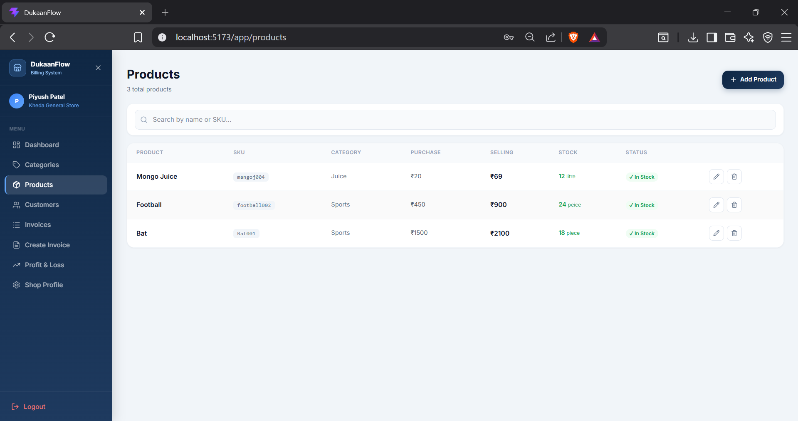

### Categories
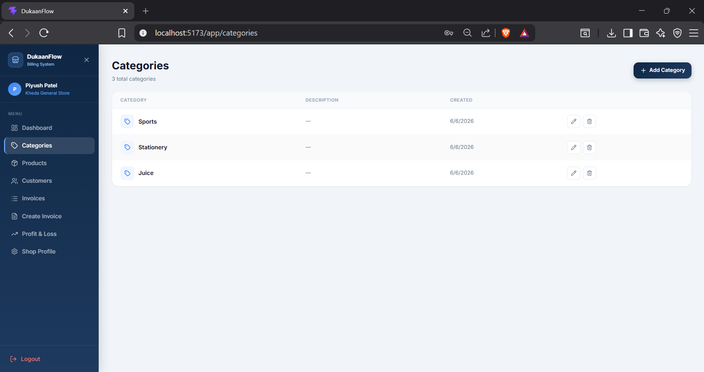

### Customers
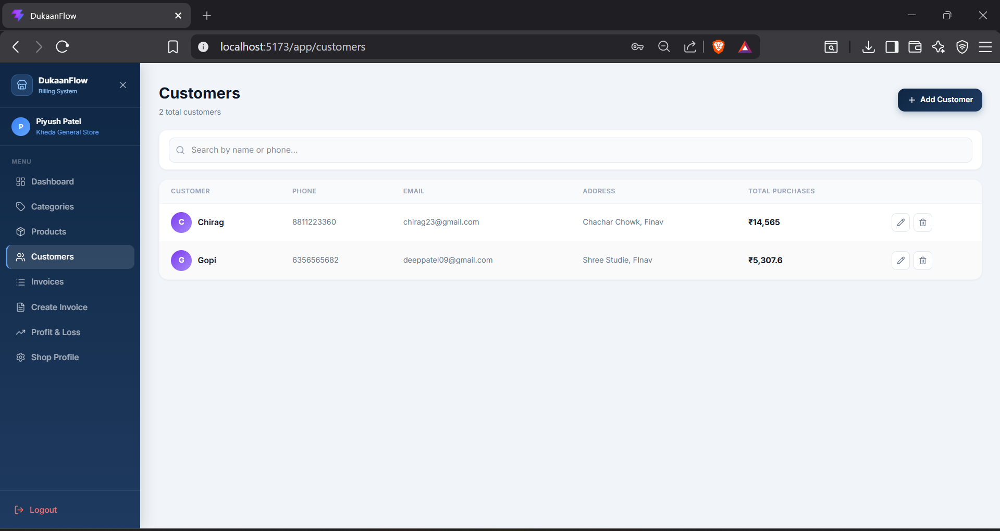

### Invoices
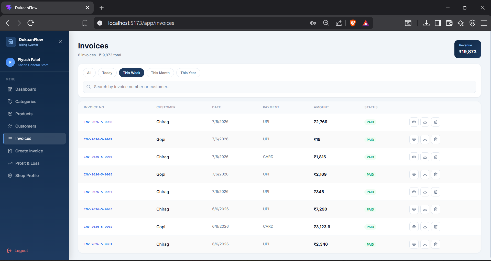

### Create Invoice
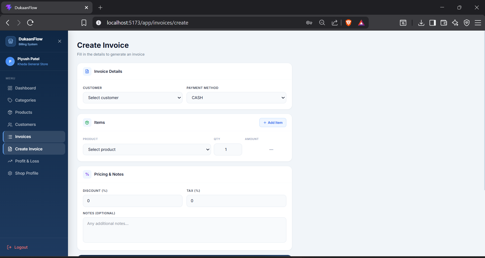

### Profit & Loss Report
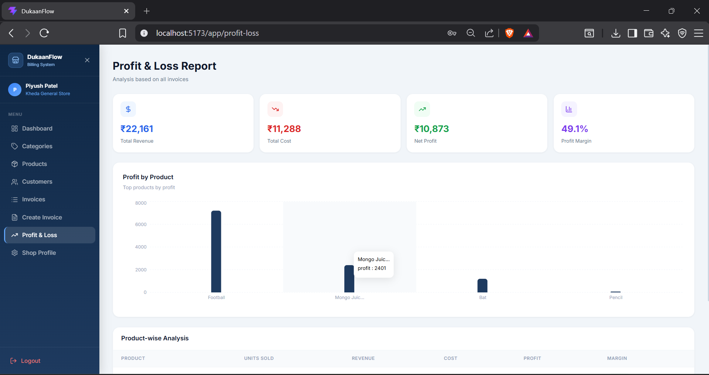

### Shop Profile
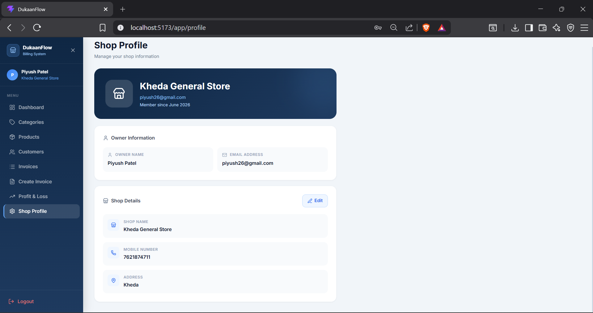

### Mobile Responsive
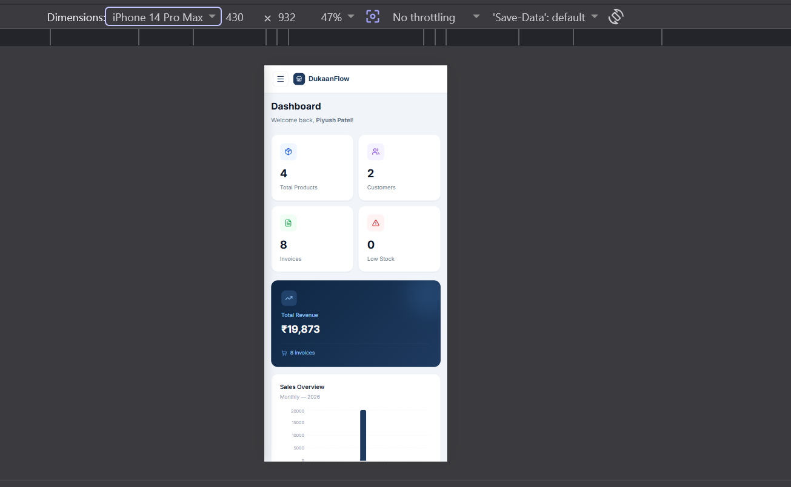

---

## 🗄 Database Schema

```
shops
├── id (PK)
├── name
├── ownerName
├── mobile (unique)
├── email (unique)
├── address
└── createdAt

users
├── id (PK)
├── name
├── email (unique)
├── password (BCrypt)
├── role (OWNER/STAFF)
├── shop_id (FK → shops)
├── active
└── createdAt

categories
├── id (PK)
├── name
├── description
├── shop_id (FK → shops)
└── createdAt                    [unique: name + shop_id]

products
├── id (PK)
├── name
├── sku
├── category_id (FK → categories)
├── shop_id (FK → shops)
├── purchasePrice
├── sellingPrice
├── stockQuantity
├── lowStockThreshold
├── unit
└── createdAt                    [unique: sku + shop_id]

customers
├── id (PK)
├── name, phone, email, address
├── shop_id (FK → shops)
├── totalPurchases
└── createdAt

invoices
├── id (PK)
├── invoiceNumber (unique)
├── customer_id (FK → customers)
├── created_by (FK → users)
├── shop_id (FK → shops)
├── subtotal, discount, taxPercent, totalAmount
├── paymentMethod, paymentStatus
├── notes
└── createdAt

invoice_items
├── id (PK)
├── invoice_id (FK → invoices)
├── product_id (FK → products)
├── productName, quantity
├── unitPrice, totalPrice
```

---

## 🚀 Getting Started

### Prerequisites
- Java 21+
- Node.js 18+
- PostgreSQL 14+
- Maven 3.8+

### Backend Setup

```bash
# Clone the repository
git clone https://github.com/yugp21/DukaanFlow.git
cd DukaanFlow/inventory-api/inventory-api

# Create application.properties in src/main/resources/
# (see application.properties.example)
```

Create `src/main/resources/application.properties`:
```properties
spring.application.name=inventory-api

spring.datasource.url=jdbc:postgresql://localhost:5432/localinventory
spring.datasource.username=your_username
spring.datasource.password=your_password

spring.jpa.hibernate.ddl-auto=update
spring.jpa.show-sql=true

jwt.secret=your_jwt_secret_key_min_32_chars
jwt.expiration=86400000

springdoc.swagger-ui.path=/swagger-ui.html
```

```bash
# Create PostgreSQL database
psql -U postgres -c "CREATE DATABASE localinventory;"

# Run the application
./mvnw spring-boot:run
```

Backend runs at `http://localhost:8080`
Swagger UI at `http://localhost:8080/swagger-ui.html`

### Frontend Setup

```bash
cd DukaanFlow/inventory-frontend

# Install dependencies
npm install

# Start development server
npm run dev
```

Frontend runs at `http://localhost:5173`

---

## 📡 API Endpoints

### Auth
| Method | Endpoint | Description |
|---|---|---|
| POST | `/api/auth/register` | Register shop + owner |
| POST | `/api/auth/login` | Login → returns JWT |

### Categories
| Method | Endpoint | Description |
|---|---|---|
| GET | `/api/categories` | Get all categories |
| POST | `/api/categories` | Create category |
| PUT | `/api/categories/{id}` | Update category |
| DELETE | `/api/categories/{id}` | Delete category |

### Products
| Method | Endpoint | Description |
|---|---|---|
| GET | `/api/products` | Get all products |
| POST | `/api/products` | Create product |
| PUT | `/api/products/{id}` | Update product |
| DELETE | `/api/products/{id}` | Delete product |

### Customers
| Method | Endpoint | Description |
|---|---|---|
| GET | `/api/customers` | Get all customers |
| POST | `/api/customers` | Add customer |
| PUT | `/api/customers/{id}` | Update customer |
| DELETE | `/api/customers/{id}` | Delete customer |

### Invoices
| Method | Endpoint | Description |
|---|---|---|
| GET | `/api/invoices` | Get all invoices |
| GET | `/api/invoices?period=week` | Filter by period |
| POST | `/api/invoices` | Create invoice (deducts stock) |
| GET | `/api/invoices/{id}/pdf` | Download PDF |
| DELETE | `/api/invoices/{id}` | Delete invoice |

### Dashboard & Reports
| Method | Endpoint | Description |
|---|---|---|
| GET | `/api/dashboard` | Summary stats |
| GET | `/api/profit-loss` | P&L report |

### Shop
| Method | Endpoint | Description |
|---|---|---|
| GET | `/api/shop` | Get shop profile |
| PUT | `/api/shop` | Update shop info |

> All endpoints except `/api/auth/**` require `Authorization: Bearer <token>` header.

---

## 🔐 Security

- Passwords hashed with **BCrypt** (never stored in plain text)
- **JWT tokens** expire in 24 hours
- All data scoped to authenticated shop via `ShopContext` — cross-shop access is impossible
- Sensitive config loaded from environment variables (never hardcoded)

---

## 📁 Project Structure

```
DukaanFlow/
├── inventory-api/inventory-api/     # Spring Boot Backend
│   └── src/main/java/com/localinventory/inventory_api/
│       ├── auth/                    # Registration & Login
│       ├── category/                # Category CRUD
│       ├── config/                  # Security & CORS config
│       ├── customer/                # Customer CRUD
│       ├── dashboard/               # Stats & P&L
│       ├── exception/               # Global error handling
│       ├── invoice/                 # Invoice + PDF generation
│       ├── product/                 # Product CRUD
│       ├── security/                # JWT filter, util, ShopContext
│       ├── shop/                    # Shop profile
│       └── user/                    # User management
│
└── inventory-frontend/              # React Frontend
    └── src/
        ├── api/                     # Axios client
        ├── components/              # Layout, Sidebar, PrivateRoute
        ├── context/                 # AuthContext
        ├── hooks/                   # useWindowSize
        └── pages/                   # All page components
```

---

## 👨‍💻 Author

**Yug Patel**
- GitHub: [@yugp21](https://github.com/yugp21)
- Information Technology Student | Gujarat, India

---

<div align="center">
  <i>Built with ❤️ for local businesses across India</i>
</div>
